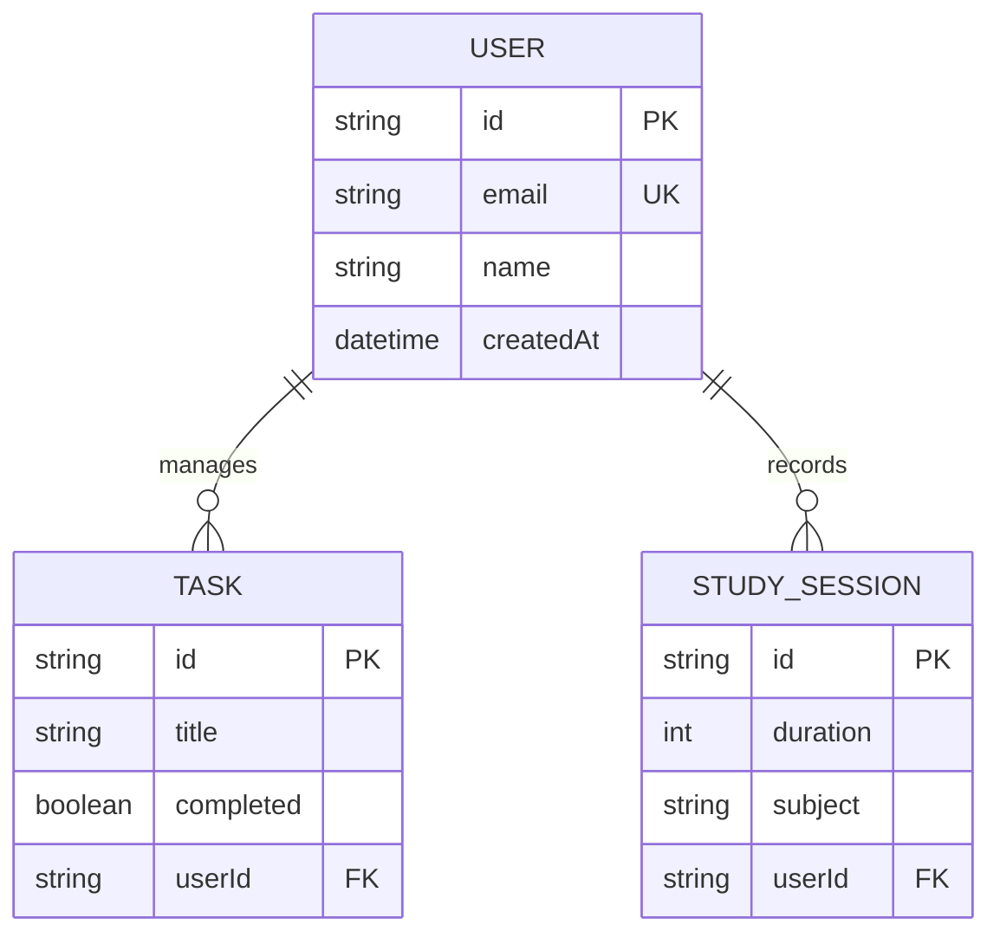

# StudyTracker 🚀: The Ultimate AI-Powered Academic Companion

StudyTracker is a sophisticated, full-stack ecosystem designed to revolutionize how students manage their learning journey. By combining **Generative AI (Gemini 1.5 Flash)** with a **Premium Design System**, StudyTracker provides a seamless bridge between web-based planning and mobile-first execution.

---

## 🏗️ Table of Contents
1. [Vision & Key Highlights](#vision--key-highlights)
2. [Ecosystem at a Glance](#ecosystem-at-a-glance)
3. [AI Intelligence Deep Dive](#ai-intelligence-deep-dive)
4. [Responsive Web Experience Hub](#responsive-web-experience-hub)
5. [Premium Mobile Platform](#premium-mobile-platform)
6. [Frontend Architecture & State Management](#frontend-architecture--state-management)
7. [The Design System & UX Primitives](#the-design-system--ux-primitives)
8. [API Documentation & System Integration](#api-documentation--system-integration)
9. [Database Schema & Data Models](#database-schema--data-models)
10. [The Automation Arsenal (Scripts)](#the-automation-arsenal-scripts)
11. [Visual Aesthetic & Motion Logic](#visual-aesthetic--motion-logic)
12. [Installation & Local Setup](#installation--local-setup)
13. [Environment Configuration Details](#environment-configuration-details)
14. [Feature Roadmap & Phase 2](#feature-roadmap--phase-2)
15. [Contributing & Development Standards](#contributing--development-standards)
16. [Troubleshooting & FAQs](#troubleshooting--faqs)
17. [License](#license)

---

## 🌟 Vision & Key Highlights

StudyTracker provides a **synchronized ecosystem** that adapts to a student's daily life. 

### 🤖 1. The Multi-Persona AI Buddy
- **Emotional Support Mode**: Built for exam-season mental wellness.
- **Strategic Roadmap Mode**: JSON-driven 3-month milestone extraction for long-term goals.
- **Elite Career Advisory Mode**: Professional Markdown guidance with day-to-day actionable schedules.

### 🏙️ 2. Distributed Web Portability
Built with **Next.js 16**, featuring a high-performance Tutor Console and Doubt Solver for desktop-class learning.

---

## 🏗️ Ecosystem at a Glance

### 🌓 Web Hub: The Control Center (`/app`, `/components`)
- **AI Tutor Console (`tutor-page.tsx`)**: An interactive 70KB module for simulated live teaching.
- **Doubt Solver (`doubt-solver.tsx`)**: AI-driven homework query resolution.
- **Study Planner (`study-planner-page.tsx`)**: High-fidelity weekly view with AI-powered schedule adjustments.
- **Real-time Analytics**: Efficiency and goal tracking via `recharts`.

### 📱 Mobile Suite: Academic Mobility (`/mobile_app`)
- **Main Dashboard**: Streak and Daily Goal monitoring.
- **Focused Subjects Grid**: Course-specific silos for organization.
- **Pomodoro Timer**: Integrated productivity suite with haptic feedback.
- **Sparkle AI Chat**: Responsive, sparkle-branded AI chat space for mobile queries.

---

## 🤖 AI Intelligence Deep Dive

Located in `app/actions/ai.ts`, the AI utilizes **Gemini 1.5 Flash** with specialized system instructions:

| Persona | System Instruction Snippet | Primary Output |
| :--- | :--- | :--- |
| **The Buddy** | *"You are a friendly, cool study companion... crack jokes and offer emotional support."* | Natural Chat |
| **The Planner** | *"Create a structured 3-month study roadmap... Return the roadmap as a JSON object."* | JSON Roadmaps |
| **The Architect** | *"You are an elite Career Advisor... format response in professional Markdown."* | Markdown Guides |

---

## 💻 Responsive Web Experience Hub

The web platform features eighteen (18) high-density study modules:

- **Dashboard Home**: Real-time overview of current tasks and upcoming study sessions.
- **AI Chat Page**: Persistent chat interface for long-form academic research.
- **Analytics Page**: Breakdown of study duration, subject distribution, and focus score.
- **Doubt Solver**: One-click solution tool for complex homework problems.
- **Flashcard System**: AI-driven or manual flashcard generation for active recall.
- **Guidance Portal**: Direct access to career roadmaps and educational paths.
- **Auth System**: Modern, secure login/signup with Glassmorphism aesthetics.
- **Resource Hub**: Central storage for PDFs, images, and notes.
- **Settings**: Comprehensive theme, profile, and notification management.
- **Study Planner**: The core scheduling algorithm that adjusts based on missed sessions.

---

## 💎 The Design System & UX Primitives

Featuring fifty-seven (57) unique UI primitives located in `components/ui/`, including:

- **Sidebar (21KB)**: A desktop-class navigation system for seamless module switching.
- **Chart (10KB)**: High-performance data visualization wrappers.
- **Command (5KB)**: OS-style global search and command pallet.
- **Calendar**: Rich interactive date-picker for exam scheduling.
- **Card**: Premium Glassmorphism containers with `oklch` border logic.
- **Dialog/Drawer**: Responsive overlay modals for all viewport sizes.
- **Input Group**: Rich input fields with integrated iconography.
- **Toast/Sonner**: Real-time notification management.
- **Tooltip/Popover**: Contextual help markers for better UX.

---

## 📡 API Documentation & System Integration

StudyTracker uses a standardized REST API for high-frequency data synchronization:

### **Session API (`/api/sessions`)**
- `GET /api/sessions`: Retrieve sorted study logs.
- `POST /api/sessions`: Record a new 45-minute focus session.
- `DELETE /api/sessions/:id`: Remove specific records.

### **Task API (`/api/tasks`)**
- `GET /api/tasks`: Fetch active todos.
- `POST /api/tasks`: Unified task creation.
- `PUT /api/tasks/:id`: Toggle completion or edit content.
- `DELETE /api/tasks/:id`: Batch removal support.

### **User API (`/api/users`)**
- `GET /api/users/profile`: Authenticated profile retrieval.
- `UPDATE /api/users/profile`: Profile and avatar updates.

---

## 📊 Database Schema & Data Models

StudyTracker uses **Prisma** for a type-safe relational model (`schema.prisma`):

- **User**: The central node storing profile details and timestamps.
- **Task**: To-do items linked to a specific `userId`.
- **StudySession**: Time records linked to users, subjects, and specific durations.



---

## 🛠️ The Automation Arsenal (Scripts)

Scripts located in the root and `/scripts` directory for power-user data management:

### **PowerShell Suite**
- **`fix_quiz_lines.ps1`**: Complexity-aware parser for malformed quiz data.
- **`fix_timetable_lines.ps1`**: Automated schedule alignment tool.
- **`quiz_append.ps1`**: Facilitates bulk interactive quiz generation.
- **`cleanup_encoding.ps1`**: Normalizes UTF-8 encoding across the repository.

### **Python Suite**
- **`aggressive_cleanup.py`**: Removes non-ASCII characters from legacy assets.
- **`clean_ui.py`**: Pre-production UI cleanup tool.
- **`final_cleanup.py`**: Global normalization script for build-readiness.

---

## 🧩 Internal Logic Flow (Study Planner)

The **AI Study Planner** algorithm (`study-planner-page.tsx`) follows a 4-step logic:
1. **Input Collection**: Users provide subjects, exam dates, and difficulty (1-10).
2. **Mock AI Slotting**: Algorithm sorts subjects by difficulty and proximity to exam dates.
3. **Session Generation**: Creates 45-minute study blocks interspersed with 15-minute breaks.
4. **Dynamic Adjustment**: If a session is missed, one-click "AI Adjust" swaps uncompleted slots to optimize coverage.

---

## 🎨 Visual Aesthetic & Motion Logic

### **Core Design Tokens (`globals.css`)**
- **Mesh Background**: HSLA multi-radial gradient system.
- **Animated Blobs**: Custom infinite `7s` scale/translate logic.
- **Floating Effect**: `3s` ease-in-out translation for premium interactivity.

### **Mobile Design Tokens (`app_shared.dart`)**
- **Futuristic Gradient**: Indigo-Purple-Pink blend.
- **Glow Shadows**: Custom shader-ready logic for neon effects.

---

## 🚀 Installation & Local Setup

### Prerequisites
- **Node.js** 18+ ($pnpm$) & **Flutter SDK** 3.0+.
- **Gemini 1.5 Flash API Key** from [Google AI Studio](https://aistudio.google.com/).

### Web Hub Setup
```bash
pnpm install
npx prisma db push
pnpm run dev
```

### Mobile Hub Setup
```bash
cd mobile_app
flutter pub get
flutter run
```

---

## ⚙️ Environment Configuration

Example `.env` required for full functionality:

```properties
# AI Logic
GOOGLE_GENERATIVE_AI_API_KEY=your_key_here

# Persistence
DATABASE_URL="file:./dev.db"

# Telemetry
NEXT_PUBLIC_VERCEL_ANALYTICS_ID=your_id
```

---

## 📅 Roadmap & Phase 2
- [x] AI Roadmaps & Doubts
- [x] Premium Dark Mode
- [x] Pomodoro & Stats
- [ ] **Phase 2.1**: Real-time WebSocket Sync.
- [ ] **Phase 2.2**: Voice-Activated AI Assistant.
- [ ] **Phase 2.3**: Multi-Subject PDF OCR Analysis.

---

## 📄 License
This project is open-source under the **MIT License**.

---
*Built with ❤️ for better learning by [StudyTracker Team]*
